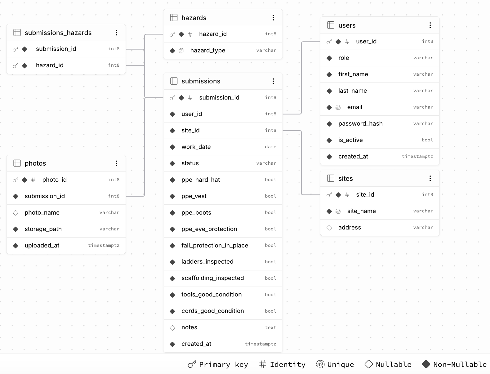

# RAS Site Safety Forms

Internal-tool style web app for the RAS Junior Developer technical assessment:
framers submit daily safety forms (with photos) and admins review them.

## Features

- **Framer:** log in, fill out the safety form (site, date, checklist, hazards, notes, photos) on a phone or desktop, and see their own submissions.
- **Admin:** today's summary (submissions per site, who has not submitted), a list grouped by site with site/worker/date filters, a detail view with photos, and a "mark as reviewed" action.

## Tech stack

- Frontend: Next.js (App Router, JavaScript) + Tailwind CSS
- Backend: Express (Node.js) with `pg`(PostgreSQL Driver), `bcryptjs`(Password Hashing), `jsonwebtoken`(JWT Authentication), `multer` (File Upload Middleware)
- Database & file storage: Supabase (PostgreSQL + private Storage bucket)
- Auth: JWT (Bearer token) with two roles, `framer` and `admin`

## Project structure

```
frontend/   Next.js app
backend/    Express API (routes, middleware, seed script)
docs/       Database schema (schema.sql) and ERD
```

## Setup

Requires Node 20+ and a Supabase project.

1. In Supabase, run `docs/schema.sql` in the SQL editor and create a **private** Storage bucket (its name goes into `SUPABASE_BUCKET`).
2. Backend:
   ```bash
   cd backend
   cp .env.example .env   # fill in the values
   npm install
   npm run seed           # demo sites, hazards and users
   npm run dev            # http://localhost:4000 (check /health)
   ```
3. Frontend:
   ```bash
   cd frontend
   cp .env.example .env.local   # NEXT_PUBLIC_API_URL=http://localhost:4000
   npm install
   npm run dev                  # http://localhost:3000
   ```

## Test accounts

| Role   | Email            | Password   |
| ------ | ---------------- | ---------- |
| Admin  | admin@ras.test   | Admin123!  |
| Framer | framer1@ras.test | Framer123! |
| Framer | framer2@ras.test | Framer123! |

Demo data only, created by `npm run seed`.
`npm run seed:demo` adds two more framers (`framer3@ras.test`, `framer4@ras.test`, same password).

## Assumptions

- One submission per framer, site and date (unique constraint).
- Submissions cannot be edited once sent (the spec asks to create and view them), so the record stays trustworthy. A framer who needs a correction contacts a supervisor.
- Photos are optional: up to 5 per submission, JPEG/PNG/WebP, 10 MB each. They are checked in the browser and again on the server (by file content), stored in a private bucket and shown through temporary links that expire after 1 hour.
- Status is `submitted` or `reviewed`. An admin marks a submission as reviewed; who reviewed it is not stored.
- "Not submitted today" means active framers with no submission for that date at any site (there are no site assignments). "Today" is the admin's local date.
- Passwords are hashed with bcrypt. The JWT expires after 8 hours and is kept in `localStorage` for simplicity (an httpOnly cookie would be safer against XSS). There are no refresh tokens or token revocation.
- A framer can only open their own submissions; someone else's returns "not found". The admin list shows at most 500 rows (no pagination).
- On free hosting the API may sleep when idle, so the first request after a pause can take up to a minute.

## Database



- `users` 1-N `submissions`, `sites` 1-N `submissions`, `submissions` 1-N `photos`
- `submissions` N-M `hazards` through `submissions_hazards`
- Photo files live in the private Storage bucket; `photos` only stores their path.
- Also enforced: one submission per user, site and date; `role` is `framer` or `admin`; `status` is `submitted` or `reviewed`.

The full schema is in `docs/schema.sql`.

## Links

- Live app: https://ras-jd-assessment.vercel.app
